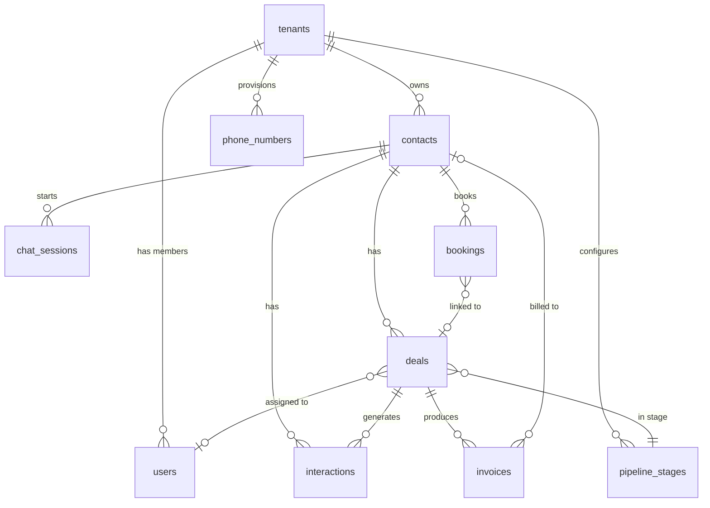

# Database Schema

## Overview
LeadAnchor uses **Supabase** (managed PostgreSQL) with:
- **Drizzle ORM** for type-safe queries in the API server
- **Supabase Auth** for authentication (uses `auth.users` table)
- **Row Level Security (RLS)** for multi-tenant data isolation
- **Supabase Realtime** for live data subscriptions

## Entity Relationship Diagram



## Core Tables

### `tenants`
The root entity. Every business on the platform is a tenant.

```sql
CREATE TABLE tenants (
  id UUID PRIMARY KEY DEFAULT gen_random_uuid(),
  name TEXT NOT NULL,
  slug TEXT UNIQUE NOT NULL,  -- URL-safe identifier for website
  track TEXT CHECK (track IN ('trades', 'predictable_services')),
  phone TEXT,                  -- Primary business phone
  address TEXT,
  city TEXT,
  state TEXT,
  zip TEXT,
  hours TEXT,
  logo_url TEXT,
  website_theme JSONB DEFAULT '{"template":"professional-dark","primaryColor":"#3B82F6","accentColor":"#10B981","fontFamily":"Inter"}',
  integrations JSONB DEFAULT '{"telnyx":false,"stripe":false,"google_business":false}',
  ghost_lead_config JSONB DEFAULT '{"enabled":true,"sms_template":null,"sms_delay_seconds":30}',
  stripe_account_id TEXT,      -- Stripe Connect account
  telnyx_connection_id TEXT,   -- Telnyx connection
  subscription_plan TEXT DEFAULT 'starter',
  subscription_status TEXT DEFAULT 'active',
  created_at TIMESTAMPTZ DEFAULT now(),
  updated_at TIMESTAMPTZ DEFAULT now()
);

CREATE INDEX idx_tenants_slug ON tenants(slug);
```

### `users`
Team members linked to a tenant. References Supabase `auth.users`.

```sql
CREATE TABLE users (
  id UUID PRIMARY KEY REFERENCES auth.users(id) ON DELETE CASCADE,
  tenant_id UUID REFERENCES tenants(id) ON DELETE CASCADE,
  role TEXT NOT NULL CHECK (role IN ('super_admin', 'admin', 'agent', 'viewer')),
  display_name TEXT,
  avatar_url TEXT,
  push_token TEXT,             -- Expo push notification token
  push_platform TEXT,          -- 'ios' or 'android'
  is_active BOOLEAN DEFAULT true,
  created_at TIMESTAMPTZ DEFAULT now(),
  updated_at TIMESTAMPTZ DEFAULT now()
);

CREATE INDEX idx_users_tenant_id ON users(tenant_id);
```

### `contacts`
Customers and leads.

```sql
CREATE TABLE contacts (
  id UUID PRIMARY KEY DEFAULT gen_random_uuid(),
  tenant_id UUID NOT NULL REFERENCES tenants(id) ON DELETE CASCADE,
  first_name TEXT,
  last_name TEXT,
  phone TEXT,
  email TEXT,
  address TEXT,
  city TEXT,
  state TEXT,
  source TEXT CHECK (source IN ('phone','chat','website','referral','google','ghost_lead','manual','sms')),
  tags TEXT[] DEFAULT '{}',
  metadata JSONB DEFAULT '{}',
  deleted_at TIMESTAMPTZ,      -- Soft delete
  created_at TIMESTAMPTZ DEFAULT now(),
  updated_at TIMESTAMPTZ DEFAULT now()
);

CREATE INDEX idx_contacts_tenant_id ON contacts(tenant_id);
CREATE INDEX idx_contacts_phone ON contacts(tenant_id, phone);
CREATE INDEX idx_contacts_source ON contacts(tenant_id, source);
```

### `pipeline_stages`
Customizable pipeline stages per tenant.

```sql
CREATE TABLE pipeline_stages (
  id UUID PRIMARY KEY DEFAULT gen_random_uuid(),
  tenant_id UUID NOT NULL REFERENCES tenants(id) ON DELETE CASCADE,
  name TEXT NOT NULL,
  position INT NOT NULL,       -- Display order
  color TEXT DEFAULT '#3B82F6',
  is_closed BOOLEAN DEFAULT false,  -- True for terminal stages like "Completed"
  created_at TIMESTAMPTZ DEFAULT now()
);

CREATE INDEX idx_pipeline_stages_tenant_id ON pipeline_stages(tenant_id);
CREATE UNIQUE INDEX uq_pipeline_stages_tenant_position ON pipeline_stages(tenant_id, position);
```

### `deals`
Pipeline opportunities linked to contacts.

```sql
CREATE TABLE deals (
  id UUID PRIMARY KEY DEFAULT gen_random_uuid(),
  tenant_id UUID NOT NULL REFERENCES tenants(id) ON DELETE CASCADE,
  contact_id UUID REFERENCES contacts(id) ON DELETE SET NULL,
  stage_id UUID NOT NULL REFERENCES pipeline_stages(id),
  title TEXT NOT NULL,
  value DECIMAL(12,2),         -- Dollar amount
  priority TEXT CHECK (priority IN ('high', 'medium', 'low')) DEFAULT 'medium',
  source TEXT,                 -- How the lead was acquired
  assigned_to UUID REFERENCES users(id) ON DELETE SET NULL,
  notes TEXT,
  closed_at TIMESTAMPTZ,
  deleted_at TIMESTAMPTZ,      -- Soft delete
  created_at TIMESTAMPTZ DEFAULT now(),
  updated_at TIMESTAMPTZ DEFAULT now()
);

CREATE INDEX idx_deals_tenant_id ON deals(tenant_id);
CREATE INDEX idx_deals_contact_id ON deals(contact_id);
CREATE INDEX idx_deals_stage_id ON deals(stage_id);
CREATE INDEX idx_deals_assigned_to ON deals(assigned_to);
CREATE INDEX idx_deals_priority ON deals(tenant_id, priority);
```

### `interactions`
Activity feed — all events (calls, SMS, chat, bookings, notes).

```sql
CREATE TABLE interactions (
  id UUID PRIMARY KEY DEFAULT gen_random_uuid(),
  tenant_id UUID NOT NULL REFERENCES tenants(id) ON DELETE CASCADE,
  contact_id UUID REFERENCES contacts(id) ON DELETE CASCADE,
  deal_id UUID REFERENCES deals(id) ON DELETE SET NULL,
  type TEXT NOT NULL CHECK (type IN ('call','sms','chat','email','booking','note','ghost_lead','stage_change')),
  direction TEXT CHECK (direction IN ('inbound', 'outbound', 'system')),
  title TEXT,
  body TEXT,
  metadata JSONB DEFAULT '{}',  -- Type-specific data (call_duration, recording_url, etc.)
  created_at TIMESTAMPTZ DEFAULT now()
);

CREATE INDEX idx_interactions_tenant_id ON interactions(tenant_id);
CREATE INDEX idx_interactions_contact_id ON interactions(contact_id);
CREATE INDEX idx_interactions_deal_id ON interactions(deal_id);
CREATE INDEX idx_interactions_type ON interactions(tenant_id, type);
CREATE INDEX idx_interactions_created_at ON interactions(tenant_id, created_at DESC);
```

### `phone_numbers`
Telnyx-provisioned tracking numbers.

```sql
CREATE TABLE phone_numbers (
  id UUID PRIMARY KEY DEFAULT gen_random_uuid(),
  tenant_id UUID NOT NULL REFERENCES tenants(id) ON DELETE CASCADE,
  number TEXT NOT NULL,
  telnyx_number_id TEXT,
  telnyx_connection_id TEXT,
  telnyx_messaging_profile_id TEXT,
  type TEXT CHECK (type IN ('tracking', 'sms', 'main')) DEFAULT 'tracking',
  is_active BOOLEAN DEFAULT true,
  created_at TIMESTAMPTZ DEFAULT now()
);

CREATE UNIQUE INDEX uq_phone_numbers_number ON phone_numbers(number);
CREATE INDEX idx_phone_numbers_tenant_id ON phone_numbers(tenant_id);
```

### `chat_sessions`
AI chatbot conversation sessions.

```sql
CREATE TABLE chat_sessions (
  id UUID PRIMARY KEY DEFAULT gen_random_uuid(),
  tenant_id UUID NOT NULL REFERENCES tenants(id) ON DELETE CASCADE,
  contact_id UUID REFERENCES contacts(id) ON DELETE SET NULL,
  messages JSONB DEFAULT '[]',  -- Array of {role, content, timestamp}
  status TEXT CHECK (status IN ('active', 'resolved', 'escalated')) DEFAULT 'active',
  metadata JSONB DEFAULT '{}',  -- { qualified_at, agent_takeover_at, qualification_data }
  created_at TIMESTAMPTZ DEFAULT now(),
  resolved_at TIMESTAMPTZ
);

CREATE INDEX idx_chat_sessions_tenant_id ON chat_sessions(tenant_id);
CREATE INDEX idx_chat_sessions_status ON chat_sessions(tenant_id, status);
```

### `bookings`
Appointment/service bookings.

```sql
CREATE TABLE bookings (
  id UUID PRIMARY KEY DEFAULT gen_random_uuid(),
  tenant_id UUID NOT NULL REFERENCES tenants(id) ON DELETE CASCADE,
  contact_id UUID REFERENCES contacts(id) ON DELETE SET NULL,
  deal_id UUID REFERENCES deals(id) ON DELETE SET NULL,
  scheduled_at TIMESTAMPTZ NOT NULL,
  duration_minutes INT DEFAULT 60,
  service_type TEXT,
  status TEXT CHECK (status IN ('pending','confirmed','completed','cancelled','no_show')) DEFAULT 'pending',
  notes TEXT,
  reminder_sent BOOLEAN DEFAULT false,
  created_at TIMESTAMPTZ DEFAULT now(),
  updated_at TIMESTAMPTZ DEFAULT now()
);

CREATE INDEX idx_bookings_tenant_id ON bookings(tenant_id);
CREATE INDEX idx_bookings_scheduled_at ON bookings(tenant_id, scheduled_at);
CREATE INDEX idx_bookings_contact_id ON bookings(contact_id);
```

### `invoices`
Payment records via Stripe.

```sql
CREATE TABLE invoices (
  id UUID PRIMARY KEY DEFAULT gen_random_uuid(),
  tenant_id UUID NOT NULL REFERENCES tenants(id) ON DELETE CASCADE,
  deal_id UUID REFERENCES deals(id) ON DELETE SET NULL,
  contact_id UUID REFERENCES contacts(id) ON DELETE SET NULL,
  stripe_invoice_id TEXT,
  stripe_payment_intent_id TEXT,
  amount DECIMAL(12,2) NOT NULL,
  status TEXT CHECK (status IN ('draft','sent','paid','overdue','cancelled')) DEFAULT 'draft',
  due_date DATE,
  paid_at TIMESTAMPTZ,
  line_items JSONB DEFAULT '[]',  -- [{description, quantity, unit_price, total}]
  created_at TIMESTAMPTZ DEFAULT now(),
  updated_at TIMESTAMPTZ DEFAULT now()
);

CREATE INDEX idx_invoices_tenant_id ON invoices(tenant_id);
CREATE INDEX idx_invoices_deal_id ON invoices(deal_id);
CREATE INDEX idx_invoices_status ON invoices(tenant_id, status);
```

### `webhook_logs`
Raw webhook payloads for debugging.

```sql
CREATE TABLE webhook_logs (
  id UUID PRIMARY KEY DEFAULT gen_random_uuid(),
  tenant_id UUID REFERENCES tenants(id) ON DELETE SET NULL,
  source TEXT NOT NULL CHECK (source IN ('telnyx', 'stripe', 'google')),
  event_type TEXT NOT NULL,
  payload JSONB NOT NULL,
  processed BOOLEAN DEFAULT false,
  error TEXT,                   -- Error message if processing failed
  created_at TIMESTAMPTZ DEFAULT now()
);

CREATE INDEX idx_webhook_logs_source ON webhook_logs(source, event_type);
CREATE INDEX idx_webhook_logs_created_at ON webhook_logs(created_at);
-- Cleanup: DELETE FROM webhook_logs WHERE created_at < now() - interval '30 days';
```

## Utility Functions

### Auto-update `updated_at`
```sql
CREATE OR REPLACE FUNCTION update_updated_at_column()
RETURNS TRIGGER AS $$
BEGIN
  NEW.updated_at = now();
  RETURN NEW;
END;
$$ LANGUAGE plpgsql;

-- Apply to all mutable tables
CREATE TRIGGER set_updated_at BEFORE UPDATE ON tenants
  FOR EACH ROW EXECUTE FUNCTION update_updated_at_column();
CREATE TRIGGER set_updated_at BEFORE UPDATE ON users
  FOR EACH ROW EXECUTE FUNCTION update_updated_at_column();
CREATE TRIGGER set_updated_at BEFORE UPDATE ON contacts
  FOR EACH ROW EXECUTE FUNCTION update_updated_at_column();
CREATE TRIGGER set_updated_at BEFORE UPDATE ON deals
  FOR EACH ROW EXECUTE FUNCTION update_updated_at_column();
CREATE TRIGGER set_updated_at BEFORE UPDATE ON bookings
  FOR EACH ROW EXECUTE FUNCTION update_updated_at_column();
CREATE TRIGGER set_updated_at BEFORE UPDATE ON invoices
  FOR EACH ROW EXECUTE FUNCTION update_updated_at_column();
```

### Default Pipeline Stages (on tenant creation)
```sql
CREATE OR REPLACE FUNCTION create_default_pipeline_stages()
RETURNS TRIGGER AS $$
BEGIN
  INSERT INTO pipeline_stages (tenant_id, name, position, color, is_closed) VALUES
    (NEW.id, 'New Opportunity', 1, '#3B82F6', false),
    (NEW.id, 'Quote Sent', 2, '#F59E0B', false),
    (NEW.id, 'Deposit Paid', 3, '#10B981', false),
    (NEW.id, 'Completed', 4, '#6366F1', true);
  RETURN NEW;
END;
$$ LANGUAGE plpgsql;

CREATE TRIGGER create_pipeline_on_tenant
  AFTER INSERT ON tenants
  FOR EACH ROW EXECUTE FUNCTION create_default_pipeline_stages();
```

## Row Level Security Policies

Applied to all tenant-scoped tables. Example for `contacts`:

```sql
ALTER TABLE contacts ENABLE ROW LEVEL SECURITY;

CREATE POLICY "contacts_tenant_select" ON contacts
  FOR SELECT USING (tenant_id = (auth.jwt() -> 'app_metadata' ->> 'tenant_id')::uuid);

CREATE POLICY "contacts_tenant_insert" ON contacts
  FOR INSERT WITH CHECK (tenant_id = (auth.jwt() -> 'app_metadata' ->> 'tenant_id')::uuid);

CREATE POLICY "contacts_tenant_update" ON contacts
  FOR UPDATE USING (tenant_id = (auth.jwt() -> 'app_metadata' ->> 'tenant_id')::uuid);

CREATE POLICY "contacts_tenant_delete" ON contacts
  FOR DELETE USING (
    tenant_id = (auth.jwt() -> 'app_metadata' ->> 'tenant_id')::uuid
    AND (auth.jwt() -> 'app_metadata' ->> 'role') IN ('super_admin', 'admin')
  );

-- Repeat pattern for: deals, interactions, phone_numbers,
-- chat_sessions, bookings, invoices, pipeline_stages
```

## Migration Workflow
1. `npx supabase migration new descriptive_name`
2. Write SQL in `supabase/migrations/<timestamp>_descriptive_name.sql`
3. Test: `npx supabase db reset` (drops and recreates from migrations)
4. Push: `npx supabase db push` (applies to linked remote project)
5. CI auto-applies via `db-migrate.yml` on merge to `main`

## Seed Data
`supabase/seed.sql` creates a demo tenant with sample data for development.

## File References
| File | Purpose |
|---|---|
| `supabase/migrations/` | SQL migration files |
| `supabase/seed.sql` | Development seed data |
| `supabase/config.toml` | Supabase project config |
| `apps/api/src/db/schema.ts` | Drizzle ORM schema (mirrors SQL) |
| `apps/api/src/db/index.ts` | Database connection setup |
